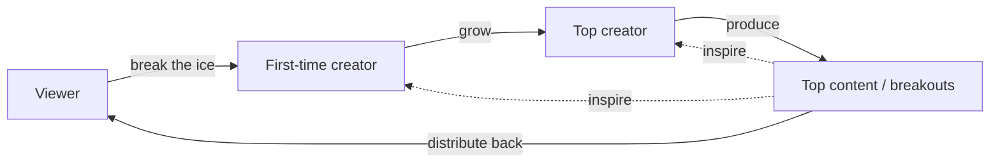
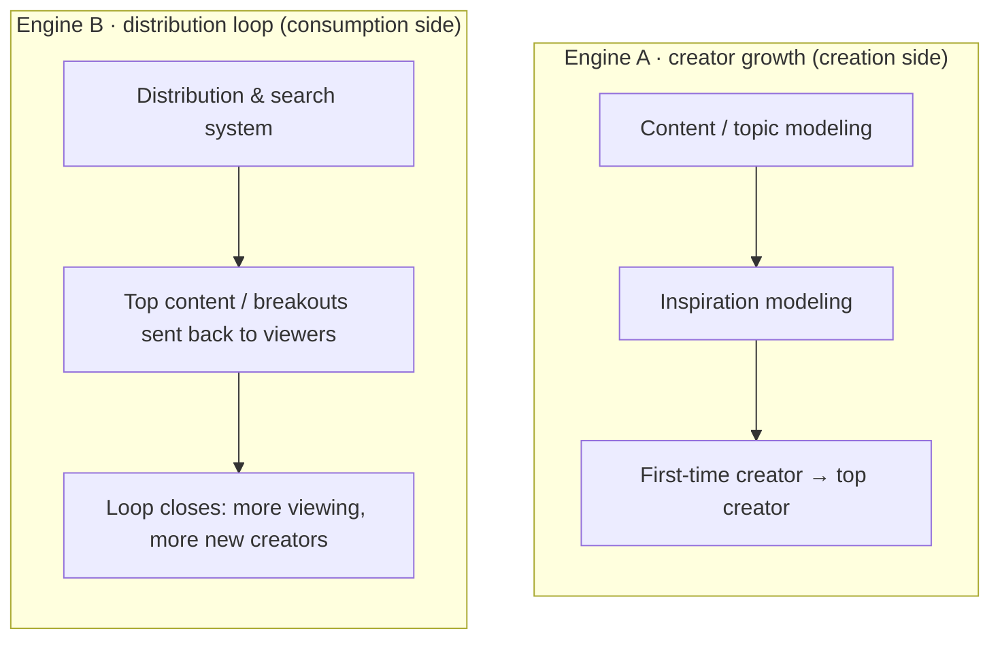
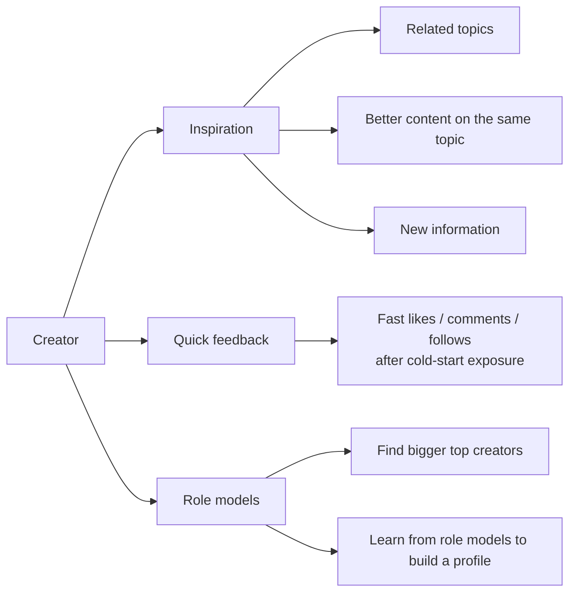

> In one line: **the distribution system powers the "distribution loop"; content/topic modeling and inspiration modeling power "creator growth". They are the flywheel's two engines.**

## 1. The flywheel

**Four nodes, one closed loop:**

| Step | Conversion | Engine |
|---|---|---|
| Viewer → first-time creator | Break the ice, build a creation habit | **Creation-propensity modeling** (entry) |
| First-time creator → top creator | Settle on topics, a niche and a fan base; keep growing | **Content/topic modeling · inspiration modeling** (growth) |
| Top creator → top content / breakouts | Produce top content and breakouts | — |
| Top content → viewers | Good content is distributed back, closing the loop | **Distribution & search system** (consumption side) |

> The two dashed arrows are the inspire loop: top content and breakouts in turn **spark first-time and top creators to create more actively**. It is not part of the linear main loop; it is a "re-creation" feedback that runs through the whole flywheel.

## 2. The two engines

- **Engine A (growth)**: helps first-time creators find topics, gives them inspiration, and pushes them toward the top. It decides **how fast** the flywheel spins.
- **Engine B (distribution)**: gets good content to viewers and pulls in new creators. It decides **whether the flywheel spins at all**.

## 3. Three levers for growing creators

This is Engine A in detail. For content/topic modeling and inspiration modeling to actually help creators, it comes down to the three things below, and much of it is delivered through the distribution and search system.

| Lever | What it means | Mainly delivered by |
|---|---|---|
| **Inspiration** | Related topics, better content on the same topic, new information | Distribution & search / inspiration modeling / content modeling |
| **Quick feedback** | Getting likes, comments and follows quickly during cold start | Cold-start distribution |
| **Role models** | Finding bigger top creators and learning from them to build a profile | Creator discovery |

## 4. Where each modeling task sits in the flywheel

| Task | Step | In one line |
|---|---|---|
| **Creation-propensity modeling** (will this viewer try creating; will they remix or imitate what they are watching) | Viewer → first-time creator | Turn a viewer into a first-time creator (entry conversion) |
| **Inspiration modeling** | First-time creator → top creator | Give inspiration, drive growth, help creators move up |
| **Distribution & search system** | Top content → viewers, plus the three levers | Distribution loop + cold-start feedback + inspiration and role-model discovery |
