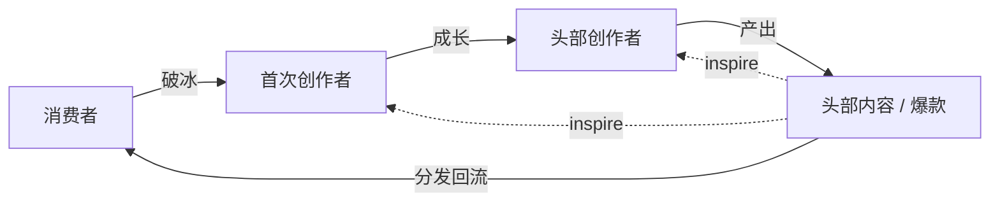
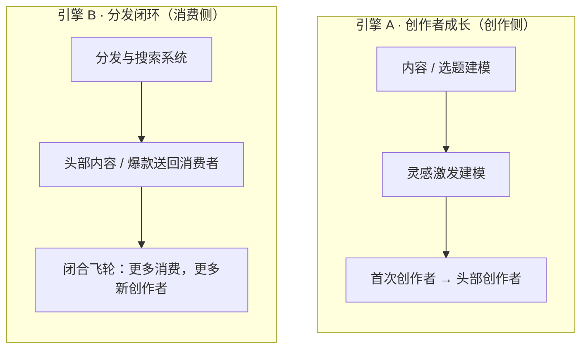
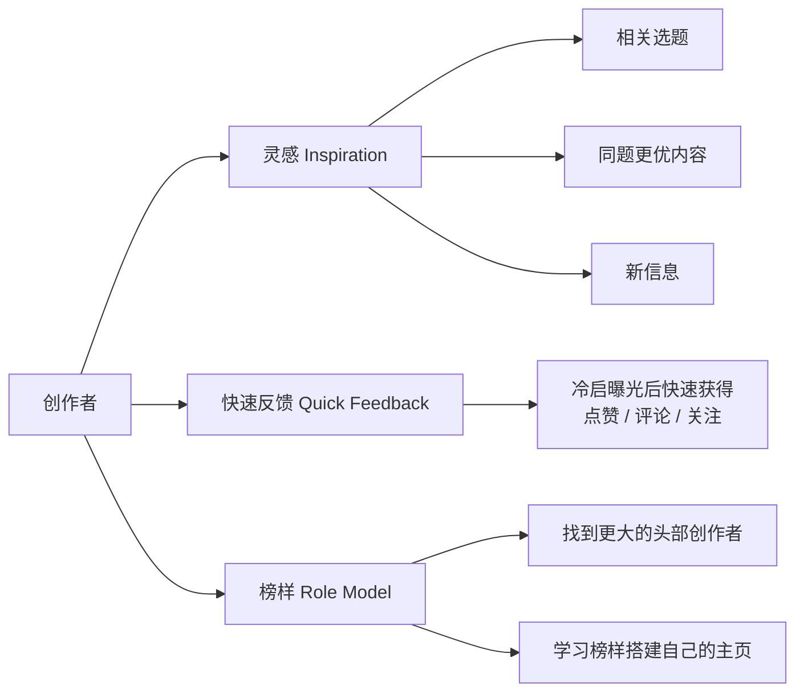

> 一句话：**分发系统驱动「分发闭环」，内容 / 选题建模与灵感激发建模驱动「创作者成长」——两者是飞轮的两个引擎。**

## 1. 主飞轮

**四个节点，一圈闭环：**

| 环节 | 转化 | 引擎 |
|---|---|---|
| 消费者 → 首次创作者 | 破冰，养成创作习惯 | **创作倾向建模**（入口） |
| 首次创作者 → 头部创作者 | 确立选题、垂类与粉丝基础，持续成长 | **内容 / 选题建模 · 灵感激发建模**（成长） |
| 头部创作者 → 头部内容 / 爆款 | 产出头部内容与爆款 | — |
| 头部内容 → 消费者 | 好内容分发回流，闭合飞轮 | **分发与搜索系统**（消费侧） |

> 图中两条虚线是 inspire 回路：头部内容和爆款反过来**激发首次创作者与头部创作者更积极地创作**。它不属于线性的主循环，而是贯穿整个飞轮的「再创作」反馈。

## 2. 两个引擎

- **引擎 A（成长）**：帮首次创作者找选题、给灵感、往头部推——决定飞轮**转得多快**。
- **引擎 B（分发）**：让好内容触达消费者、拉回新的创作者——决定飞轮**转不转得起来**。

## 3. 帮创作者成长的三个抓手

这是引擎 A 的具体展开：内容 / 选题建模和灵感激发建模要真正帮到创作者，最终落在下面三件事上，而这三件事在很大程度上要靠分发与搜索系统来兑现。

| 抓手 | 具体内容 | 主要依靠 |
|---|---|---|
| **灵感 Inspiration** | 相关选题、同题更优内容、新信息 | 分发与搜索系统 / 灵感激发建模 / 内容建模 |
| **快速反馈 Quick Feedback** | 冷启阶段快速拿到点赞、评论、关注 | 冷启分发 |
| **榜样 Role Model** | 找到更大的头部创作者，学习榜样搭建主页 | 创作者发现 |

## 4. 建模任务在飞轮中的位置

| 任务 | 作用环节 | 一句话 |
|---|---|---|
| **创作倾向建模**（会不会尝试创作，会不会模仿 / 再创作正在看的内容） | 消费者 → 首次创作者 | 把消费者变成第一次创作者（入口转化） |
| **灵感激发建模** | 首次创作者 → 头部创作者 | 给灵感、推成长，帮创作者进阶头部 |
| **分发与搜索系统** | 头部内容 → 消费者，以及三个抓手 | 分发闭环 + 冷启反馈 + 灵感与榜样发现 |
