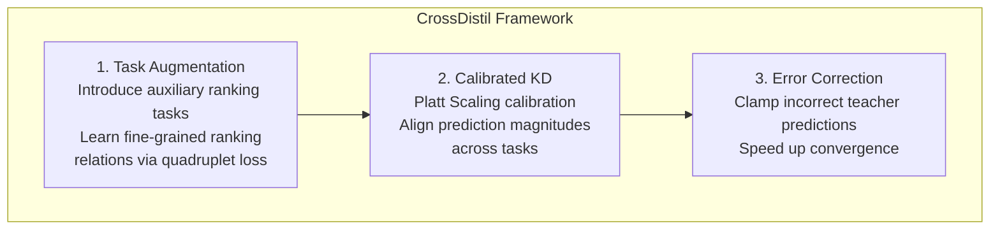
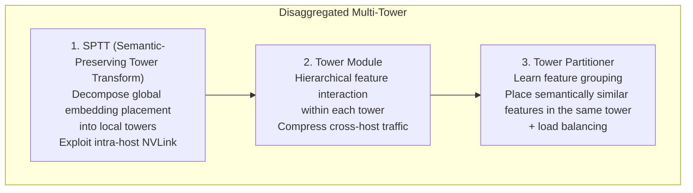
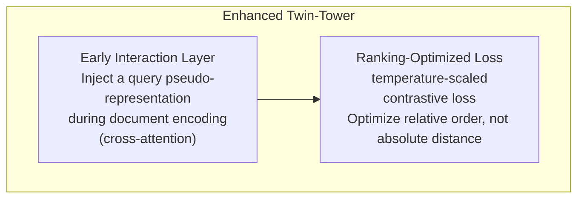
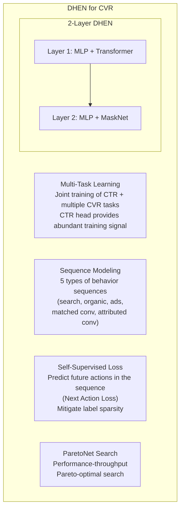
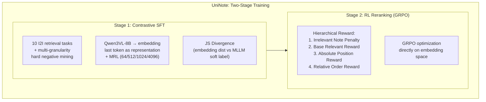

> **Compiled by**: Chris Yan | **Date**: 2026-06-05 | **Papers**: 5

---

## Paper Index

| # | Paper | Venue | Core Topic |
|---|------|------|--------|
| 1 | CrossDistil: Cross-Task Knowledge Distillation in MTL | AAAI 2022 (SJTU / Tencent) | Cross-task knowledge distillation in multi-task learning |
| 2 | Disaggregated Multi-Tower (DMT) | MLSys 2024 (Meta/Nvidia) | Topology-aware training of large-scale recommendation models |
| 3 | Enhanced Twin-Tower with Interaction & Ranking Loss | Electronics 2025 (Xi'an University of Technology) | Early interaction and ranking optimization for twin-tower models |
| 4 | DHEN for Ad CVR Prediction | WWW Companion 2025 (Pinterest) | Deep hierarchical ensemble networks for conversion-rate prediction |
| 5 | UniNote: Unified Embedding for Multimodal I2I | KDD 2026 (Xiaohongshu) | Unified multimodal embedding + RL reranking |

---

## Paper 1: CrossDistil — Cross-Task Knowledge Distillation

### Core Problem

In multi-task learning (MTL), the predictions of different tasks may carry complementary ranking information, but directly using one task's soft labels to teach another leads to **task conflict** (different tasks may rank the same item in contradictory ways).

### Method

**Three key contributions**:

1. **Augmented Ranking Tasks** — Quadruplets (pos_A, neg_A, pos_B, neg_B) are constructed into auxiliary ranking tasks, avoiding the ranking conflicts caused by direct cross-task distillation
2. **Calibrated Distillation** — Platt Scaling (`r̃ = P·r + Q`) aligns the teacher's logit magnitudes before KD, removing the bias caused by differing positive rates across tasks
3. **Error Correction** — When a teacher prediction contradicts the hard label, the logit is clamped, so an inaccurate early-stage teacher does not mislead the student

### Key Findings

- On the TikTok and WeChat datasets, CrossDistil achieves the best AUC and Multi-AUC over all MTL baselines (Shared-Bottom, Cross-Stitch, MMoE, PLE)
- The auxiliary ranking tasks contribute more than calibration and error correction
- Direct cross-task KD (without the augmented tasks) actually degrades performance

### Implications for Practice

> In industrial two-tower retrieval models, adding an auxiliary alignment loss between the sequence encoder and the item embeddings is a common way to add supervision, and it is essentially a form of cross-module knowledge transfer. CrossDistil's calibration idea suggests checking that the two embedding scales match before applying a cosine penalty; otherwise, direct alignment may be biased.

---

## Paper 2: Disaggregated Multi-Tower (DMT) — Topology-Aware Training

### Core Problem

In recommendation model training, embedding AlltoAll communication accounts for **27.5%** of training time (Figure 1). The root cause is a **mismatch** between the model architecture (flat, global interactions) and the datacenter topology (hierarchical, with intra-host NVLink >> inter-host RDMA).

### Method

**Core idea**: Split a single flat model into multiple towers, each corresponding to a group of semantically related features and placed within a single host. Communication within a tower uses high-bandwidth NVLink; cross-host AlltoAll between towers happens only when necessary.

### Key Numbers

| Metric | Result |
|------|------|
| Training speedup | Up to **1.9×** (64 H100 GPUs) |
| AUC impact | Neutral (on DLRM and DCN) |
| Communication reduction | Tower Module compression ratio up to 16× |
| Scale | 16 to 512 GPUs, across three generations (V100/A100/H100) |

### Implications for Practice

> For recommendation models with a very large number of sparse features, DMT's SPTT + Tower Module approach applies directly when scaling to more GPUs: group sparse features by semantics, partition them automatically with the Tower Partitioner, and reduce training communication overhead.

---

## Paper 3: Enhanced Twin-Tower — Early Interaction + Ranking Loss

### Core Problem

Conventional twin-tower models have two limitations: (1) query and document are encoded fully independently, with no **early interaction**; (2) training uses a loss on absolute similarity scores, which tends to **overfit to a specific distance threshold**.

### Method

**Two improvements**:

1. **Early Interaction** — Cross-attention is added to the document encoder to generate a pseudo-query representation from document content, so the document embedding already contains query information at encoding time. MRR improves by 9.2%
2. **Ranking-Optimized Loss** — A temperature-scaled contrastive loss focuses on relative ranking rather than absolute similarity scores and is more robust to label noise. F1 improves by 14.6%

### Key Findings

- On three QA datasets (NQ/TQA/WQ), Top-20 accuracy improves by 20.3% over BM25
- Inference latency is only 17 ms (retrieving over 1K candidates), on par with DPR
- The two components are synergistic: using them together works better than either alone

### Implications for Practice

> The idea is similar to cross-attention inside user behavior sequence encoders in recommendation models: both inject query-side information at encoding time. This paper, however, targets NLP retrieval rather than recommendation. In recommendation, an auxiliary loss that directly optimizes embedding alignment (rather than only softmax CE) can likewise be viewed as a ranking-aware loss.

---

## Paper 4: DHEN for CVR — Pinterest's Conversion-Rate Prediction in Practice

### Core Problem

CVR prediction faces three challenges: (1) labels are **extremely sparse** (orders of magnitude fewer than CTR labels); (2) labels are **delayed** (off-site conversions arrive late); (3) labels are **noisy** (attribution is imprecise).

### Method

**Key design decisions**:

| Decision | Choice | Rationale |
|------|------|------|
| Feature Crossing | DHEN (ensemble of MLP+DCN+MaskNet+Transformer) | Better than any single module; 2 layers is optimal |
| Multi-task | Joint CTR + multiple CVR tasks | CTR head supplies abundant labels as regularization |
| Sequence types | 5 kept separate rather than merged | Separate outperforms merged |
| Self-supervised | Next Action Loss (NAL) | Better than MLM; predicting the future beats predicting the middle |
| User features | sequences > pre-trained embeddings > counting > categorical > demographic | Sequence features contribute the most |

### Online Results

| Metric | Change | Significant |
|------|------|--------|
| **CPA** | **-2.15%** | ✅ |
| **iCVR** | **+4.90%** | ✅ |
| #Conversion | +1.62% | ✅ |
| Overall CTR | -2.70% | ✅ |

**Key observation**: CTR drops while CVR rises, indicating the model more precisely identifies users who will actually convert instead of merely chasing clicks.

### Implications for Practice

> Pinterest's DHEN architecture is an ensemble of multiple feature-crossing modules. Its self-supervised next action loss addresses the problem of **giving the sequence encoder additional supervision**. A common alternative is cosine alignment, whereas they use InfoNCE for next-item prediction. They also find that sequence features matter more than pre-trained embeddings, which suggests that investing in the sequence encoder is the right direction.

---

## Paper 5: UniNote — Unified Embedding + RL Reranking

### Core Problem

Industrial I2I (item-to-item) retrieval faces three problems: (1) a **granularity mismatch** between global representations and local retrieval; (2) a **disconnect** between the embedding and ranking pipelines (retrieve-then-rerank is inefficient); (3) **heterogeneous fusion** of multimodal content (text + images + video + OCR).

### Method

**Key contributions**:

1. **Unified retrieval-ranking framework** — The conventional setup uses two models: an embedding model (retrieval) plus a reranker (ranking). UniNote uses a single model for both retrieval and ranking; the RL stage gives the embedding space ranking ability directly
2. **Contrastive SFT** — Turns an MLLM into an embedding model (using the last token) and uses JS divergence to align the embedding distance distribution with the MLLM soft-label distribution. Combined with MRL to support multiple deployment dimensions
3. **GRPO Reranking** — RL training with a 4-level hierarchical reward directly optimizes ranking quality in the embedding space. No separate reranker model is needed
4. **Hard Negative Mining** — A three-tier strategy: similarity-based (global candidate pool) + rule-based (different elements within the same note serve as negatives for each other) + counterfactual (replacing part of the content)

### Key Results

| Task | UniNote R@1 | Strongest baseline R@1 | Gain |
|------|------------|-----------------|------|
| Subordinate Retrieval (I2Note) | **93.7** | 61.1 (Qwen3VL) | +32.6 |
| Subordinate Retrieval (T2Note) | **53.1** | 39.6 (Qwen3VL) | +13.5 |
| Semantic Extraction (Note2I) | **90.2** | 80.8 (Qwen3VL) | +9.4 |
| Content Relevance (Note2Note) | **15.9** | 15.8 (RzenEmbed) | +0.1 |

### Implications for Practice

> This paper is highly relevant to VLM embedding work. A few directly transferable ideas:
> 1. **MRL** — Use a Matryoshka loss to support deployment at multiple dimensions
> 2. **GRPO for ranking** — Use RL to directly optimize ranking quality in the embedding space, without a separate reranker. Retrieval models trained only with contrastive learning could consider adding an RL stage
> 3. **Three-tier hard negative mining** — Instead of relying only on in-batch negatives, try similarity-based + rule-based + counterfactual negatives
> 4. **JS divergence vs cosine penalty** — UniNote uses JS divergence to align two distributions (embedding vs MLLM soft label), which is more principled than a plain cosine penalty

---

## Cross-Paper Comparison

### Theme: Adding Extra Supervision to Embedding / Sequence Models

| Paper | Method | Loss Type | Effect |
|------|------|---------|------|
| CrossDistil | Cross-task soft-label distillation | Calibrated KD (CE) | AUC +0.3~0.5% |
| DHEN (Pinterest) | Next Action Loss (sequence prediction) | InfoNCE | PR-AUC +2.18% |
| UniNote (Xiaohongshu) | GRPO RL reranking | Hierarchical reward | R@5 +1.4% |

### Theme: Efficiency Optimization for Large-Scale Recommendation Models

| Paper | Optimization Level | Method | Speedup |
|------|---------|------|--------|
| DMT (Meta) | Training communication | SPTT + Tower Module | **1.9×** |
| DHEN (Pinterest) | Model selection | ParetoNet (AUC vs throughput) | Pareto-optimal |
| UniNote (Xiaohongshu) | Deployment flexibility | MRL (64/512/1024/4096) | Flexible storage/retrieval |

---

## Takeaways for Industrial Recommender Systems

| Takeaway | Source | Applies To |
|------|------|--------|
| Optimize embedding ranking with an RL stage | UniNote (GRPO) | Ranking quality of retrieval models, removing the need for a separate reranker |
| Multi-tier hard negative mining | UniNote | Contrastive retrieval models that use only in-batch negatives; add similarity + counterfactual negatives |
| Calibrated KD to align cross-task signals | CrossDistil | Scale alignment for cross-module alignment losses |
| Self-supervised next action loss | DHEN | Extra supervision for sequence encoders |
| Automatic feature grouping with Tower Partitioner | DMT | Multi-GPU training of models with large-scale sparse features |
| ParetoNet hyperparameter search | DHEN | Choosing MLP configurations along the AUC-throughput trade-off |
