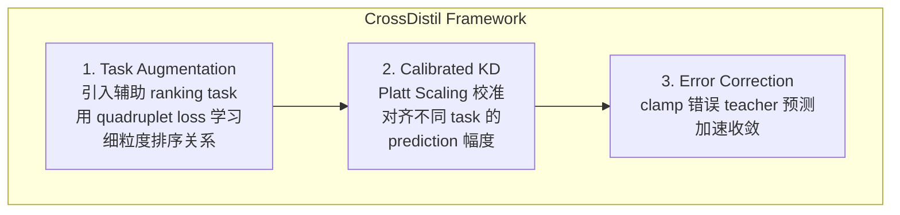
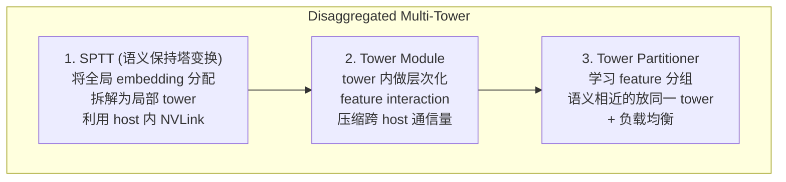
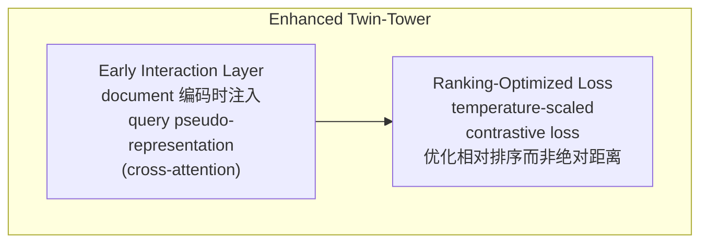
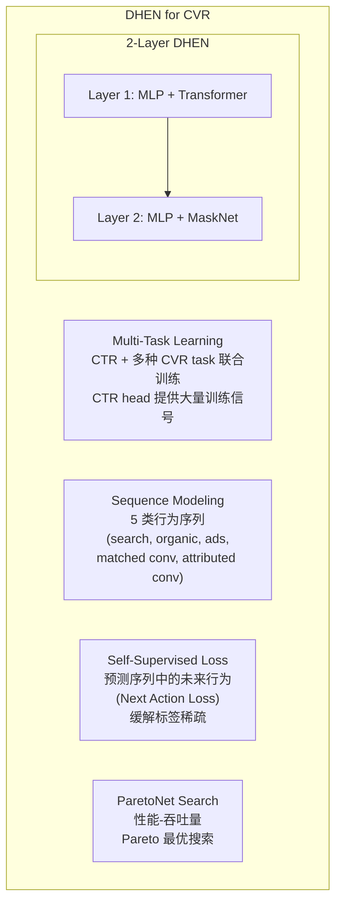
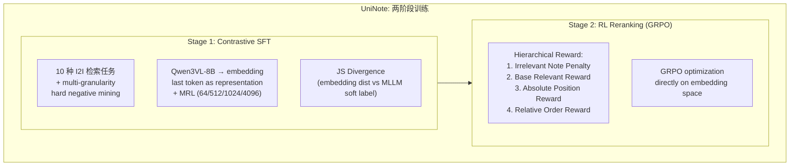

> **整理**: Chris Yan | **日期**: 2026-06-05 | **论文数量**: 5 篇

---

## 论文索引

| # | 论文 | 来源 | 核心主题 |
|---|------|------|--------|
| 1 | CrossDistil: Cross-Task Knowledge Distillation in MTL | AAAI 2022 (上交/腾讯) | 多任务学习中的跨任务知识蒸馏 |
| 2 | Disaggregated Multi-Tower (DMT) | MLSys 2024 (Meta/Nvidia) | 拓扑感知的大规模推荐模型训练 |
| 3 | Enhanced Twin-Tower with Interaction & Ranking Loss | Electronics 2025 (西安理工) | 双塔模型的早期交互与排序优化 |
| 4 | DHEN for Ad CVR Prediction | WWW Companion 2025 (Pinterest) | 深度层次化集成网络用于转化率预测 |
| 5 | UniNote: Unified Embedding for Multimodal I2I | KDD 2026 (小红书) | 多模态统一 embedding + RL reranking |

---

## Paper 1: CrossDistil — 跨任务知识蒸馏

### 核心问题

多任务学习（MTL）中，不同 task 的 prediction 可能包含互补的 ranking 信息，但直接用一个 task 的 soft label 教另一个 task 会导致 **task conflict**（不同 task 对同一 item 的排序可能矛盾）。

### 方法

**三大创新**：

1. **Augmented Ranking Tasks** — 把 (pos_A, neg_A, pos_B, neg_B) 四元组构造成辅助排序任务，避免直接跨任务蒸馏导致的排序冲突
2. **Calibrated Distillation** — 用 Platt Scaling (`r̃ = P·r + Q`) 对齐 teacher 的 logit 幅度后再做 KD，消除不同 task 正样本比例差异导致的偏差
3. **Error Correction** — 当 teacher 预测与 hard label 矛盾时，clamp logit 值，避免早期 teacher 不准时误导 student

### 关键结论

- 在 TikTok 和微信数据集上，CrossDistil 在所有 MTL baseline (Shared-Bottom, Cross-Stitch, MMoE, PLE) 上都取得了最好的 AUC 和 Multi-AUC
- Auxiliary ranking 比 calibration 和 error correction 的贡献更大
- 跨任务直接 KD（不用 augmented task）反而会导致性能下降

### 工业实践启示

> 在工业双塔召回模型中，在 sequence encoder 与 item embedding 之间加一个辅助 alignment loss，是增加监督信号的常见做法，本质上也是一种跨模块的知识传递。CrossDistil 的 calibration 思路提示：施加 cosine penalty 之前，应先检查两侧 embedding 的 scale 是否一致，否则直接对齐可能有偏差。

---

## Paper 2: Disaggregated Multi-Tower (DMT) — 拓扑感知训练

### 核心问题

推荐模型训练中，embedding AlltoAll 通信占了 **27.5%** 的训练时间（Figure 1）。根本原因是模型架构（flat, 全局交互）与数据中心拓扑（层次化，intra-host NVLink >> inter-host RDMA）的 **不匹配**。

### 方法

**核心思想**：把单一的 flat 模型拆成多个 tower，每个 tower 对应一组语义相关的 feature，部署在同一个 host 内。tower 内用 NVLink 高速通信，tower 间只在必要时做跨 host AlltoAll。

### 关键数据

| 指标 | 结果 |
|------|------|
| 训练加速 | 最高 **1.9×** (64 H100 GPUs) |
| AUC 影响 | 无损（在 DLRM、DCN 上） |
| 通信减少 | Tower Module 压缩比可达 16× |
| 适用规模 | 16 ~ 512 GPUs，跨 V100/A100/H100 三代 |

### 工业实践启示

> 对于 sparse feature 数量庞大的推荐模型，如果要 scale 到更多 GPU，DMT 的 SPTT + Tower Module 方案可以直接应用 — 把 sparse feature 按语义分组，用 Tower Partitioner 自动划分，降低训练通信开销。

---

## Paper 3: Enhanced Twin-Tower — 早期交互 + 排序 Loss

### 核心问题

传统双塔模型的两个限制：(1) query 和 document 编码完全独立，缺乏**早期交互**；(2) 训练用绝对 similarity score 做 loss，容易**过拟合到特定距离阈值**。

### 方法

**两个改进**：

1. **Early Interaction** — 在 document encoder 中加入 cross-attention，从 document 内容生成 pseudo-query representation，让 document embedding 在编码阶段就包含 query 信息。MRR 提升 9.2%
2. **Ranking-Optimized Loss** — temperature-scaled contrastive loss 关注相对排序而非绝对相似度分数，对标签噪声更鲁棒。F1 提升 14.6%

### 关键结论

- 在 NQ/TQA/WQ 三个 QA 数据集上，比 BM25 提升 20.3% Top-20 accuracy
- 推理延迟仅 17ms（检索 1K 候选），与 DPR 相当
- 两个组件有协同效应，联合使用比单独使用效果更好

### 工业实践启示

> 思路和推荐模型中用户行为序列 encoder 里的 cross-attention 类似 — 都是在编码阶段就引入 query-side 信息。但这篇是在 NLP 检索场景，而非推荐场景。推荐中直接优化 embedding 对齐（而非只做 softmax CE）的辅助 loss，也可以看作一种 ranking-aware loss。

---

## Paper 4: DHEN for CVR — Pinterest 的转化率预测实践

### 核心问题

CVR 预测面临三大挑战：(1) 标签**极度稀疏**（比 CTR 少几个数量级）；(2) 标签**延迟**（off-site 转化有延迟）；(3) 标签**噪声**（归因不精确）。

### 方法

**关键设计决策**：

| 决策 | 选择 | 原因 |
|------|------|------|
| Feature Crossing | DHEN (ensemble of MLP+DCN+MaskNet+Transformer) | 比单一模块好，2 层最优 |
| 多任务 | CTR + 多种 CVR 联合 | CTR head 提供海量标签做 regularization |
| 序列类型 | 5 种分开而非合并 | 分开比合并效果好 |
| Self-supervised | Next Action Loss (NAL) | 比 MLM 好，预测未来比预测中间好 |
| User feature | 序列 > pre-trained embedding > counting > categorical > demographic | 序列特征贡献最大 |

### 线上效果

| 指标 | 变化 | 显著性 |
|------|------|--------|
| **CPA** | **-2.15%** | ✅ |
| **iCVR** | **+4.90%** | ✅ |
| #Conversion | +1.62% | ✅ |
| Overall CTR | -2.70% | ✅ |

**重要发现**：CTR 下降但 CVR 上升 — 说明模型更精准地找到了真正会转化的用户，而不是只追求点击。

### 工业实践启示

> Pinterest 的 DHEN 架构是多种 feature crossing module 的 ensemble。其 self-supervised next action loss 解决的问题是：**给 sequence encoder 额外的监督信号**。常见的另一种做法是 cosine alignment，而他们用 InfoNCE 做 next-item prediction。另外，他们发现序列特征比 pre-trained embedding 更重要 — 说明在 sequence encoder 上的投入方向是对的。

---

## Paper 5: UniNote — 统一 Embedding + RL Reranking

### 核心问题

工业级 I2I (Item-to-Item) 检索面临三个问题：(1) 全局表征与局部检索的**粒度失配**；(2) embedding 和 ranking pipeline **割裂**（先检索再重排，效率低）；(3) 多模态内容（文本+图片+视频+OCR）的**异构融合**。

### 方法

**核心创新**：

1. **统一检索-排序框架** — 传统方案是 embedding model (retrieval) + reranker (ranking) 两个模型。UniNote 用一个模型同时做 retrieval 和 ranking，通过 RL 阶段让 embedding space 直接具备 ranking 能力
2. **Contrastive SFT** — 把 MLLM 变成 embedding model（取 last token），用 JS divergence 对齐 embedding 距离分布和 MLLM soft label 分布。配合 MRL 支持多维度部署
3. **GRPO Reranking** — 用 4 维度层次化 reward 做 RL 训练，直接优化 embedding 空间的排序质量。不需要单独的 reranker 模型
4. **Hard Negative Mining** — 三级策略：similarity-based (全局候选池) + rule-based (同 note 内不同 element 互为 neg) + counterfactual (替换部分内容)

### 关键结果

| 任务 | UniNote R@1 | 最强 baseline R@1 | 提升 |
|------|------------|-----------------|------|
| Subordinate Retrieval (I2Note) | **93.7** | 61.1 (Qwen3VL) | +32.6 |
| Subordinate Retrieval (T2Note) | **53.1** | 39.6 (Qwen3VL) | +13.5 |
| Semantic Extraction (Note2I) | **90.2** | 80.8 (Qwen3VL) | +9.4 |
| Content Relevance (Note2Note) | **15.9** | 15.8 (RzenEmbed) | +0.1 |

### 工业实践启示

> 这篇和 VLM embedding 方向高度相关。几个直接可借鉴的点：
> 1. **MRL** — 用 Matryoshka Loss 支持多维度部署
> 2. **GRPO for ranking** — 用 RL 直接优化 embedding 空间的排序质量，不需要单独的 reranker。只用 contrastive learning 训练的检索模型，可以考虑加 RL 阶段
> 3. **Hard negative mining 三级策略** — 相比只用 in-batch negatives，可以试 similarity-based + rule-based + counterfactual
> 4. **JS divergence vs cosine penalty** — UniNote 用 JS divergence 对齐两个分布（embedding vs MLLM soft label），比直接用 cosine penalty 更 principled

---

## 跨论文横向对比

### 主题：如何给 embedding/sequence model 额外的监督信号

| 论文 | 方法 | Loss 类型 | 效果 |
|------|------|---------|------|
| CrossDistil | 跨任务 soft label 蒸馏 | Calibrated KD (CE) | AUC +0.3~0.5% |
| DHEN (Pinterest) | Next Action Loss (序列预测) | InfoNCE | PR-AUC +2.18% |
| UniNote (小红书) | GRPO RL reranking | Hierarchical reward | R@5 +1.4% |

### 主题：大规模推荐模型的效率优化

| 论文 | 优化层面 | 方法 | 加速比 |
|------|---------|------|--------|
| DMT (Meta) | 训练通信 | SPTT + Tower Module | **1.9×** |
| DHEN (Pinterest) | 模型选择 | ParetoNet (AUC vs 吞吐量) | Pareto 最优 |
| UniNote (小红书) | 部署灵活性 | MRL (64/512/1024/4096) | 存储/检索灵活 |

---

## 对工业推荐系统的启发

| 启发 | 来源 | 适用场景 |
|------|------|--------|
| RL 阶段优化 embedding ranking | UniNote (GRPO) | 检索模型的排序质量，省去单独的 reranker |
| 多级 hard negative mining | UniNote | 只用 in-batch negatives 的对比学习检索模型，可加 similarity + counterfactual |
| Calibrated KD 校准跨 task 信号 | CrossDistil | 跨模块 alignment loss 的 scale 对齐 |
| Self-supervised next action loss | DHEN | sequence encoder 的额外监督信号 |
| Tower Partitioner 自动 feature 分组 | DMT | 大规模 sparse feature 模型的多 GPU 训练 |
| ParetoNet 超参搜索 | DHEN | 在 AUC 与吞吐量之间选择 MLP 配置 |
