> **Date**: 2026-07
> **Paper 1**: Large Language Models as Optimizers (OPRO) — Google DeepMind, ICLR 2024
> **Paper 2**: GR2: Generative Reasoning Re-ranker — Meta AI, arXiv 2602.07774, Jan 2026

---

## Paper 1: OPRO — Large Language Models as Optimizers

### 1.1 Core Idea

OPRO proposes a new paradigm: **using the LLM itself as the optimizer**. Classical optimization requires a formal objective function and gradient computation, yet many real-world tasks (especially prompt optimization in NLP) are hard to specify precisely in mathematical form. OPRO's key insight is that an LLM can understand an optimization problem from a natural-language description and progressively approach the optimum by iteratively generating solutions.

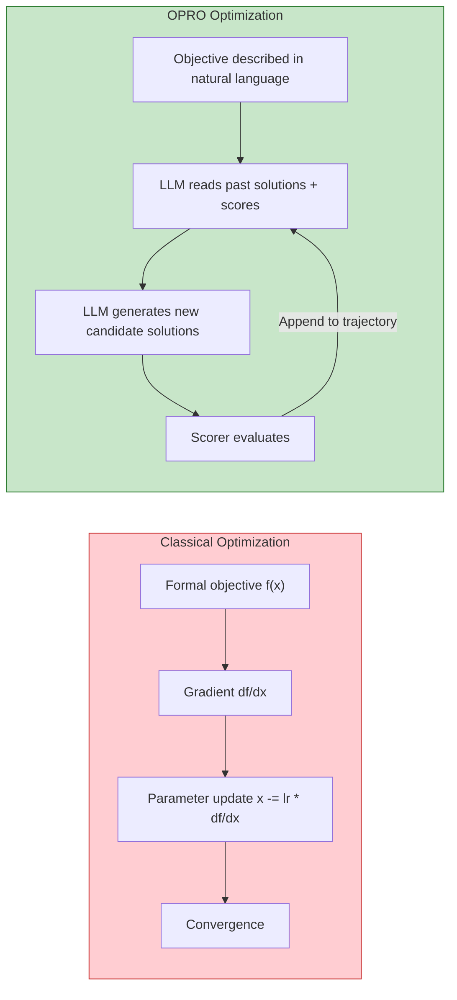

### 1.2 Method: Meta-Prompting

The core mechanism of OPRO is the **meta-prompt**, which contains two key components:

1. **Problem Description**: the optimization objective described in natural language
2. **Optimization Trajectory**: previously generated solutions and their scores, sorted in ascending order of score

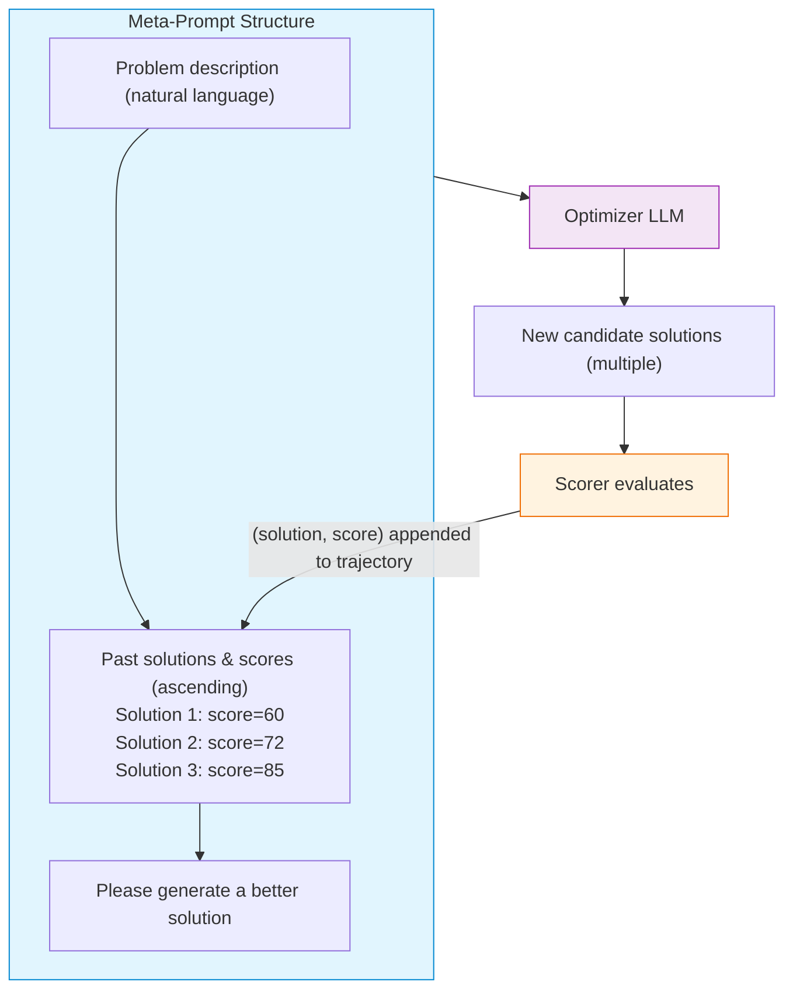

In each iteration:
- The LLM (called the **Optimizer LLM**) reads the meta-prompt
- It generates new candidate solutions
- A **Scorer** (which can be another LLM or a program) evaluates the quality of each candidate
- The new (solution, score) pairs are appended to the optimization trajectory
- Repeat until convergence or the budget is exhausted

### 1.3 Key Design Details

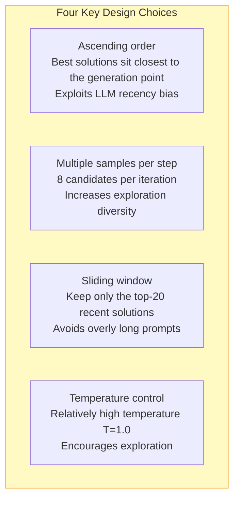

### 1.4 Application 1: Classical Optimization Problems

As a proof of concept, OPRO was tested on linear regression and the traveling salesman problem (TSP):

| Problem | Result | Evaluation |
|------|------|------|
| **Linear regression** | The LLM approaches the optimum (w=2, b=3) from scratch | Feasible, but less precise than gradient descent |
| **TSP (10 nodes)** | Tour-length error < 1% | Performance degrades as the number of nodes grows |

### 1.5 Application 2: Prompt Optimization (Core Contribution)

This is OPRO's most important application. The task is to automatically search for the optimal instruction prompt that maximizes the target LLM's (the Scorer LLM's) performance on a downstream task.

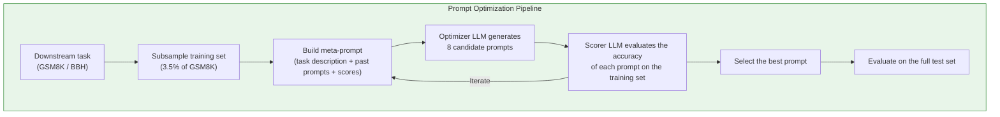

**Experimental results**:

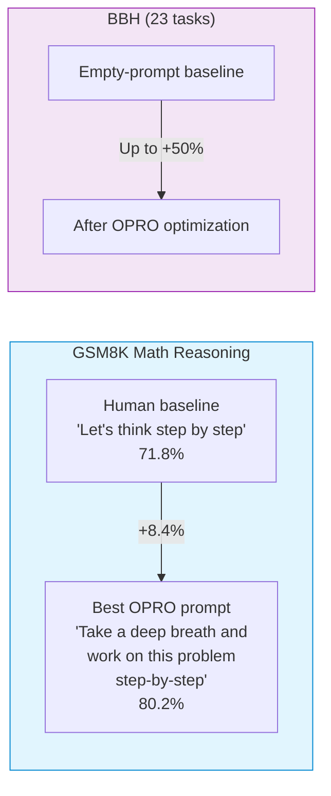

**Key findings**:
1. Different Scorer LLMs prefer different prompts — the best prompt for PaLM 2-L is not necessarily the best for GPT
2. Optimized prompts can be semantically surprising (e.g., containing emotionally encouraging phrasing)
3. The search process exhibits a clear learning curve: scores rise steadily with the number of iterations

### 1.6 Limitations

- High compute cost: each iteration requires many LLM inference calls
- Limited effectiveness on discrete, structured optimization problems (e.g., large-scale TSP)
- Prompt optimization depends heavily on the specific Scorer LLM
- No convergence guarantees

### 1.7 Takeaways

OPRO opens up the new direction of "LLM-as-optimizer," showing that LLMs can perform iterative optimization **without relying on gradients**. This is particularly valuable for problems whose objectives are hard to formalize but can be described in natural language.

---

## Paper 2: GR2 — Generative Reasoning Re-ranker

### 2.1 Core Idea

GR2 is an end-to-end LLM-based re-ranking framework for recommender systems proposed by Meta AI. Its core innovation is a **three-stage training pipeline** that combines semantic item representations, reasoning capability, and reinforcement learning, designed specifically for the re-ranking task.

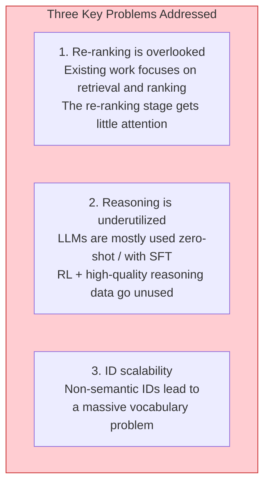

### 2.2 Three-Stage Training Pipeline

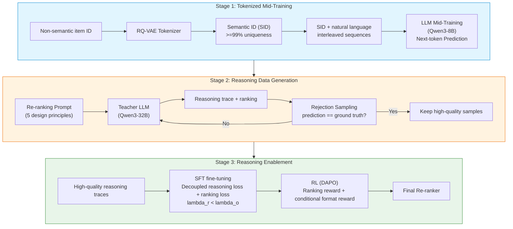

### 2.3 Stage 1: Tokenized Mid-Training

#### 2.3.1 Semantic ID (SID) Generation

**RQ-VAE** (Residual-Quantized Variational Autoencoder) is used to encode an item's text features into a sequence of discrete tokens:

```
Tokenizer(x) = (z_1, z_2, ..., z_K),   z_k in {1, ..., C_k}
```

where C_k is the size of the k-th codebook. The core idea is to apply residual quantization to a dense embedding of the item's text features, such as its title and category.

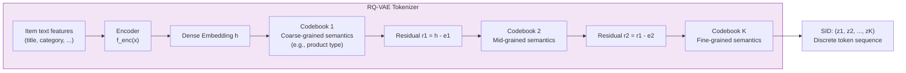

#### 2.3.2 Five Techniques for Balanced Codebook Utilization

The key challenge in training an RQ-VAE is **codebook collapse** (only a few codes get used). GR2 employs five complementary techniques:

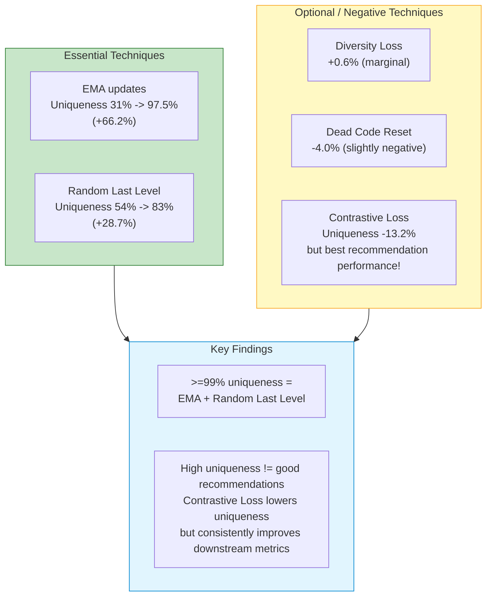

| Technique | Effect on uniqueness | Effect on recommendation performance | Importance |
|------|---------------|-----------------|--------|
| **EMA updates** | +66.2% | Positive | Essential |
| **Random Last Level** | +28.7% | Positive | Essential |
| **Diversity Loss** | +0.6% | Marginal | Optional |
| **Dead Code Reset** | -4.0% | Slightly negative | Optional |
| **Contrastive Loss** | -13.2% | **Best recommendation performance** | Complex trade-off |

#### 2.3.3 Mid-Training Strategy

Following the item-alignment idea from OneRec-Think: **interleave SID tokens and natural-language tokens within a single sequence**, and use next-token prediction to align the LLM's recommendation knowledge with its linguistic knowledge.

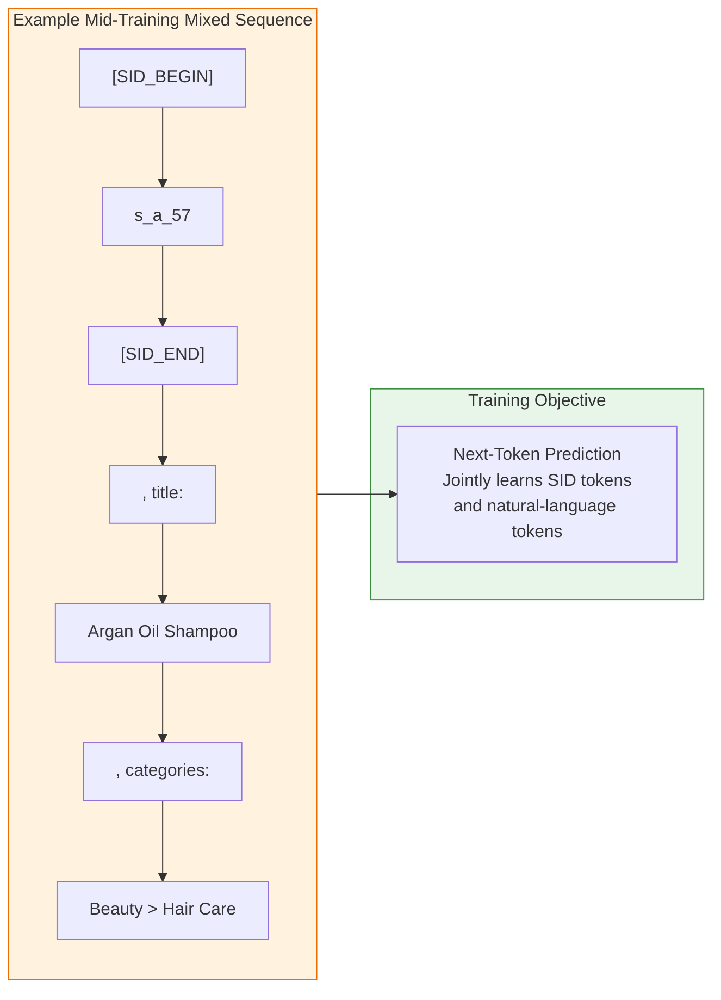

### 2.4 Stage 2: Reasoning Data Generation

#### 2.4.1 Chat-Format Training Data

Training samples use a three-role chat format:

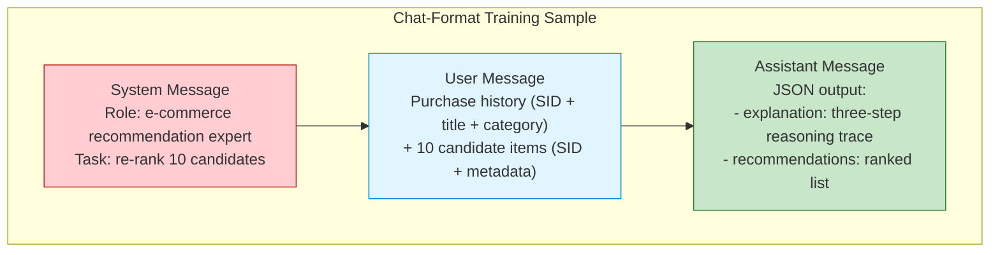

#### 2.4.2 Two Strategies for Generating Reasoning Traces

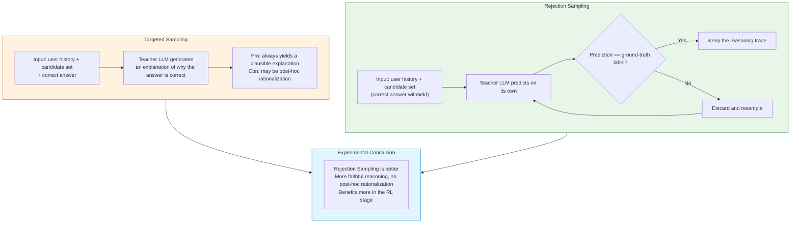

#### 2.4.3 Five Prompt Design Principles

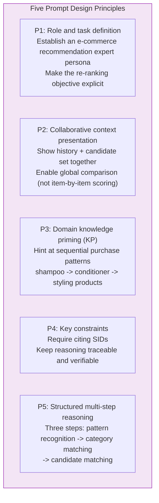

### 2.5 Stage 3: Reasoning Enablement

#### 2.5.1 SFT Stage

The student LLM (Qwen3-8B) is fine-tuned on the generated reasoning traces. The loss function **decouples reasoning from ranking**:

```
L_SFT = -lambda_r * sum(log P(r_i | P, r_<i))
        -lambda_o * sum(log P(o_j | P, tau, o_<j))

where lambda_r < lambda_o (ranking weight > reasoning weight)
loss is computed only on the assistant message
```

#### 2.5.2 RL Stage (DAPO)

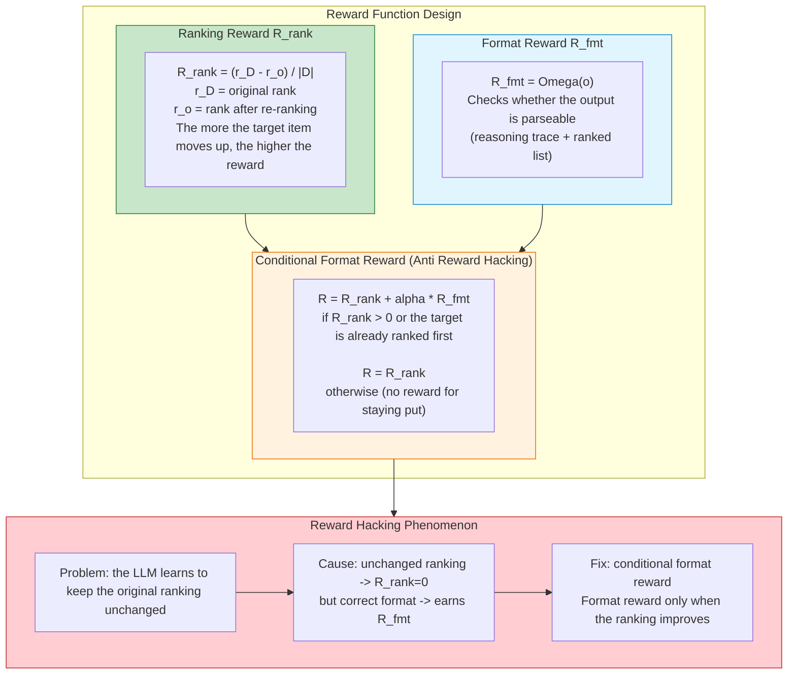

**DAPO algorithm features** (an improvement over GRPO):

| Feature | Description |
|------|------|
| Clip-Higher strategy | Decouples the lower and upper clipping ranges (epsilon_low, epsilon_high) |
| Filtering uninformative prompts | Prompts with accuracy 0 or 1 produce no gradient and are filtered out |
| Oversampling | Oversamples low-advantage samples to improve sample efficiency |
| Token-level optimization | Importance ratio is computed independently for each token |

### 2.6 Experimental Results

#### 2.6.1 Datasets

| Dataset | #Users | #Items | Avg. sequence length |
|--------|--------|---------|-------------|
| Amazon Beauty | 22,363 | 12,101 | 8.87 |
| Amazon Sports | 35,598 | 18,357 | 8.32 |

#### 2.6.2 Mid-Training Performance vs. OneRec-Think

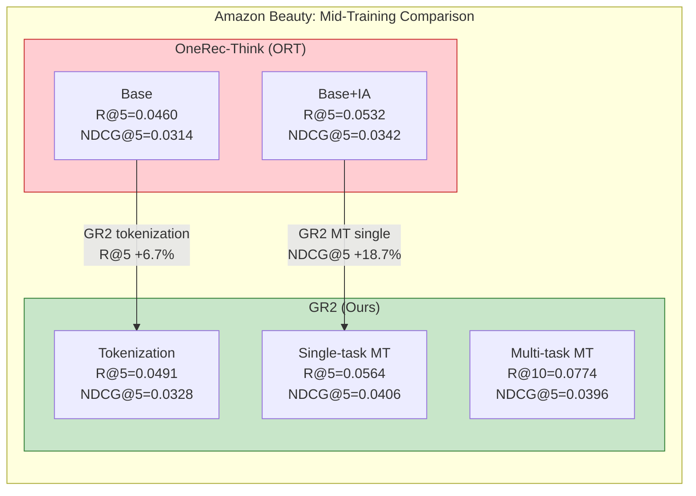

#### 2.6.3 Re-ranking Performance (Amazon Beauty)

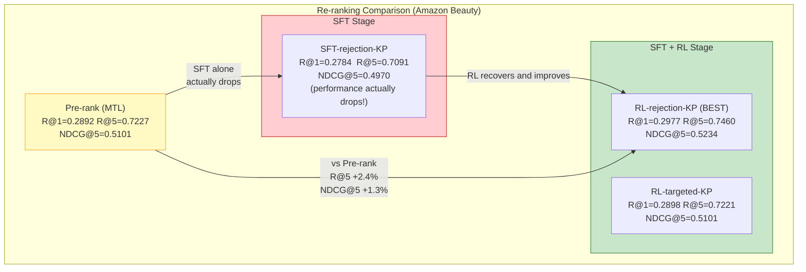

#### 2.6.4 Key Findings

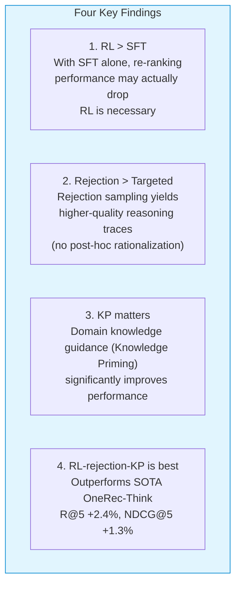

### 2.7 Takeaways

1. **Re-ranking is an overlooked yet important stage in LLM-based recommender systems** — unlike retrieval/ranking, re-ranking requires fine-grained comparison across the candidate set
2. **Reasoning is crucial for re-ranking** — but SFT alone is insufficient; RL is needed to truly optimize the ranking objective
3. **There is a trade-off between SID uniqueness and semantics** — contrastive loss lowers uniqueness but improves recommendation quality
4. **Reward design must guard against hacking** — the conditional format reward is an effective defense

---

## Comparison and Connections Between the Two Papers

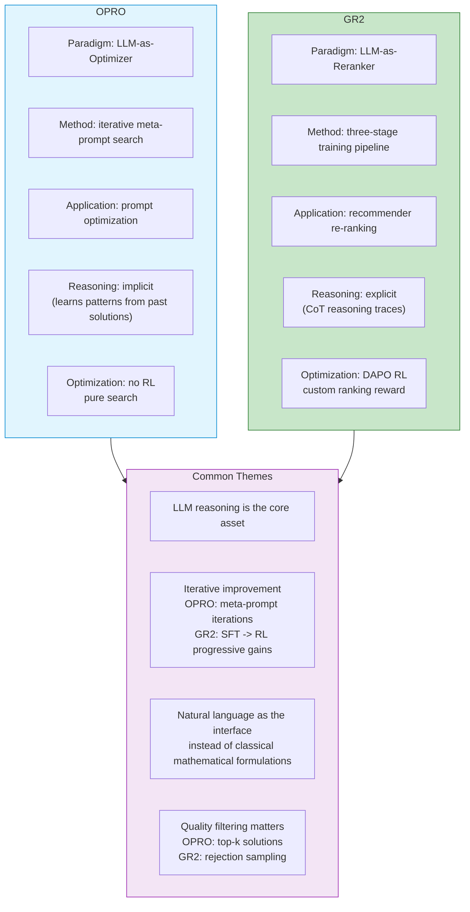

| Dimension | OPRO | GR2 |
|------|------|-----|
| **Core paradigm** | LLM as a general-purpose optimizer | LLM as a recommendation re-ranker |
| **What is optimized** | Prompts / solutions to math problems | Ordering of candidate items |
| **Search method** | Iterative meta-prompt search | Three-stage training (mid-training - SFT - RL) |
| **Role of the LLM** | Optimizer + scorer | Reasoner + ranker |
| **Reasoning style** | Implicit (learns from history) | Explicit (CoT reasoning traces) |
| **Use of RL** | None | DAPO + custom ranking reward |
| **Scale** | Academic validation (GSM8K, BBH) | Industrial-scale (Amazon, targeting large-scale deployment) |
| **Common ground** | Both leverage LLM reasoning to tackle optimization/ranking problems that are hard for traditional methods |
