> **日期**: 2026-07
> **Paper 1**: Large Language Models as Optimizers (OPRO) — Google DeepMind, ICLR 2024
> **Paper 2**: GR2: Generative Reasoning Re-ranker — Meta AI, arXiv 2602.07774, Jan 2026

---

## Paper 1: OPRO — Large Language Models as Optimizers

### 1.1 核心思想

OPRO 提出了一个全新的范式：**用 LLM 本身作为优化器**。传统优化问题需要形式化的目标函数和梯度计算，但很多现实任务（尤其是 NLP prompt 优化）难以用数学形式精确定义。OPRO 的核心洞察是：LLM 可以通过自然语言描述来理解优化问题，并通过迭代生成解来逐步逼近最优解。

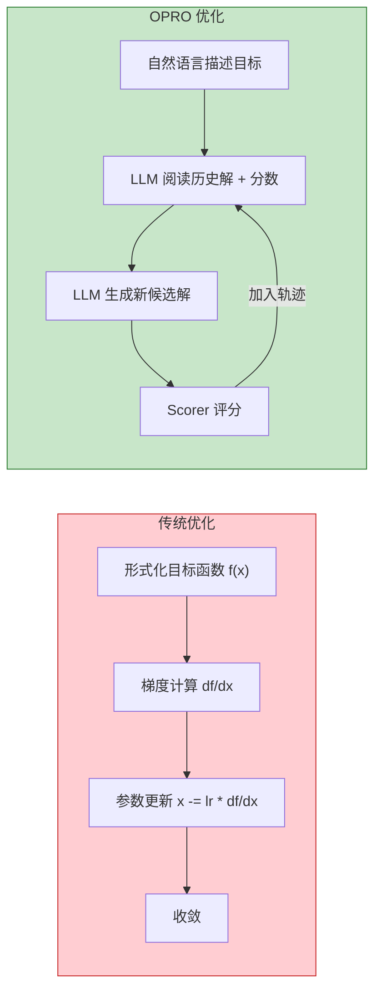

### 1.2 方法：元提示 (Meta-Prompting)

OPRO 的核心机制是**元提示 (meta-prompt)**，包含两个关键部分：

1. **问题描述 (Problem Description)**: 用自然语言描述优化目标
2. **优化轨迹 (Optimization Trajectory)**: 之前生成的解及其对应的评分，按分数升序排列

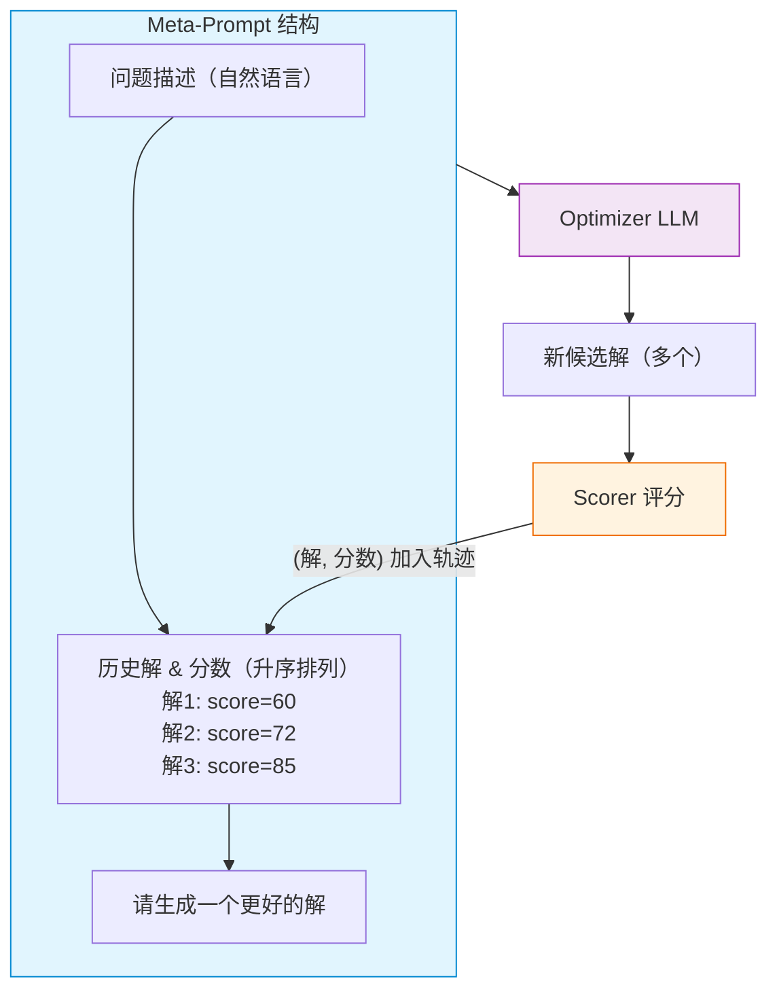

每轮迭代中：
- LLM（称为 **Optimizer LLM**）阅读 meta-prompt
- 生成新的候选解
- 用 **Scorer**（可以是另一个 LLM 或程序）评估候选解的质量
- 将新的 (解, 分数) 对加入优化轨迹
- 重复直到收敛或达到预算

### 1.3 关键设计细节

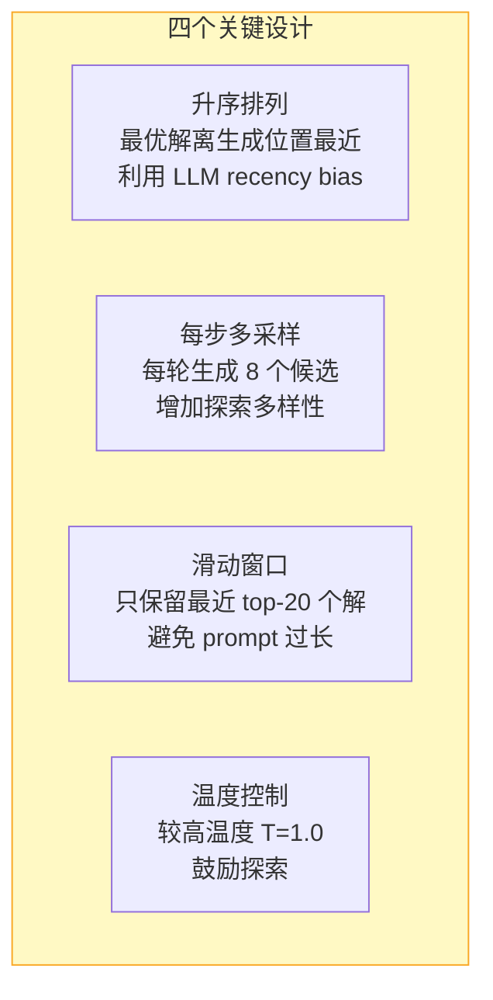

### 1.4 应用一：经典优化问题

作为概念验证，OPRO 在线性回归和旅行商问题 (TSP) 上进行了测试：

| 问题 | 结果 | 评价 |
|------|------|------|
| **线性回归** | LLM 从零逼近最优解 (w=2, b=3) | 可行，但不如梯度下降精确 |
| **TSP (10 节点)** | 路径长度误差 < 1% | 节点数增加后性能下降 |

### 1.5 应用二：Prompt 优化（核心贡献）

这是 OPRO 最重要的应用。任务是自动搜索最优的指令 prompt，使目标 LLM（Scorer LLM）在下游任务上表现最好。

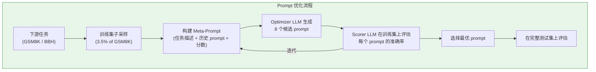

**实验结果**:

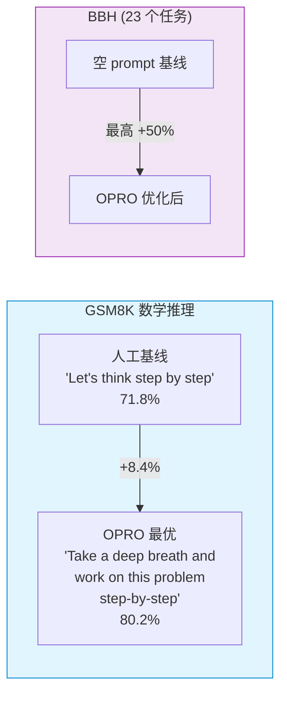

**关键发现**:
1. 不同 Scorer LLM 偏好不同的 prompt — 对 PaLM 2-L 最优的 prompt 对 GPT 不一定最优
2. 优化后的 prompt 可能在语义上出人意料（如包含情感鼓励的词汇）
3. 搜索过程展现了清晰的学习曲线：分数随迭代次数稳步上升

### 1.6 局限性

- 计算成本高：每轮需要多次 LLM 推理
- 对离散的结构化优化问题（如大规模 TSP）效果有限
- Prompt 优化高度依赖具体的 Scorer LLM
- 缺乏收敛保证

### 1.7 启示

OPRO 开辟了 "LLM-as-optimizer" 的新方向，表明 LLM 可以在**不依赖梯度**的情况下进行迭代优化。这对那些目标函数难以形式化、但可以用自然语言描述的问题特别有价值。

---

## Paper 2: GR2 — Generative Reasoning Re-ranker

### 2.1 核心思想

GR2 是 Meta AI 提出的端到端 LLM 推荐系统 re-ranking 框架。它的核心创新是**三阶段训练流水线**，将语义 item 表示、推理能力和强化学习结合，专门为 re-ranking 任务设计。

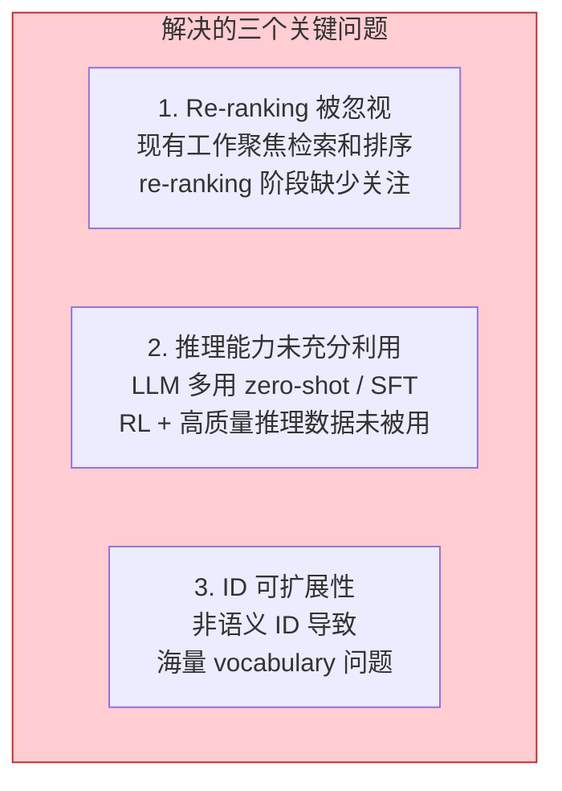

### 2.2 三阶段训练流水线

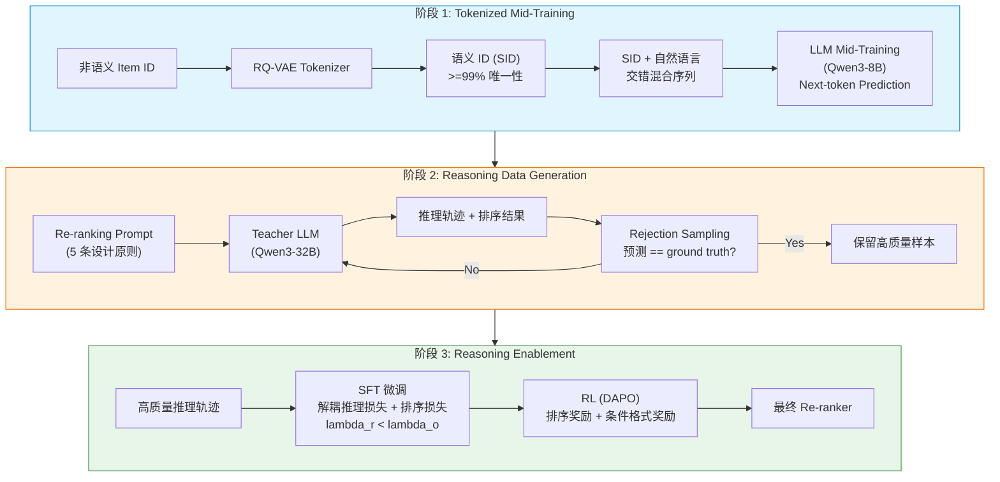

### 2.3 阶段 1: Tokenized Mid-Training

#### 2.3.1 语义 ID (SID) 生成

使用 **RQ-VAE** (Residual-Quantized Variational Autoencoder) 将 item 的文本特征编码为离散 token 序列：

```
Tokenizer(x) = (z_1, z_2, ..., z_K),   z_k in {1, ..., C_k}
```

其中 C_k 是第 k 层 codebook 的大小。核心是用 item 的标题、类目等文本特征的 dense embedding 进行残差量化。

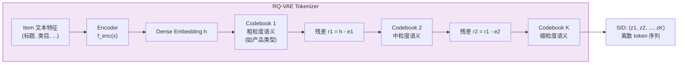

#### 2.3.2 Codebook 均衡利用的五种技术

RQ-VAE 训练的关键挑战是 **codebook collapse**（只有少数 code 被使用）。GR2 采用五种互补技术：

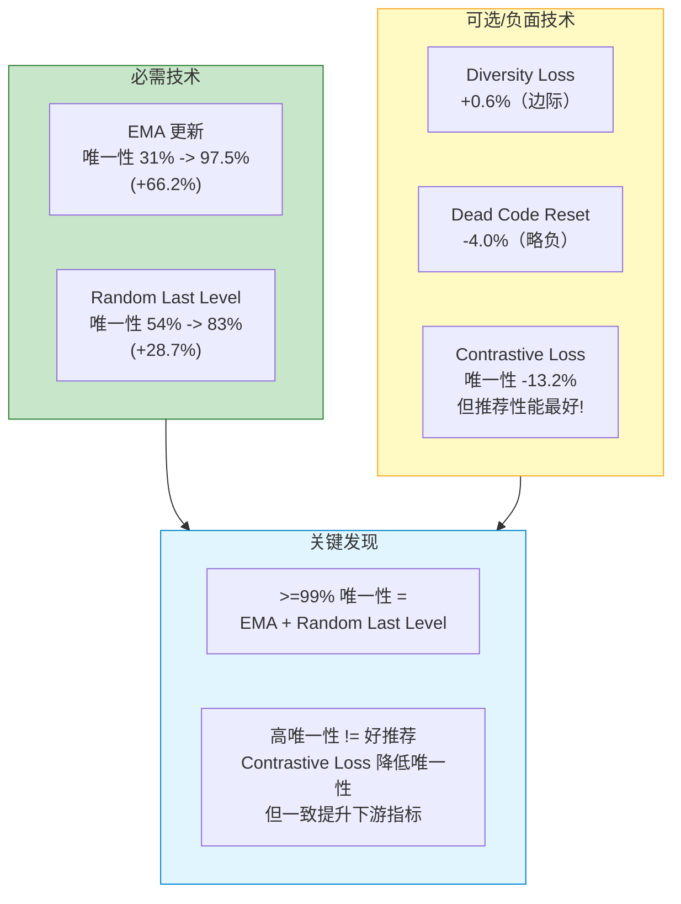

| 技术 | 对唯一性的影响 | 对推荐性能的影响 | 重要性 |
|------|---------------|-----------------|--------|
| **EMA 更新** | +66.2% | 正面 | 必需 |
| **Random Last Level** | +28.7% | 正面 | 必需 |
| **Diversity Loss** | +0.6% | 边际 | 可选 |
| **Dead Code Reset** | -4.0% | 轻微负面 | 可选 |
| **Contrastive Loss** | -13.2% | **最佳推荐性能** | 复杂 trade-off |

#### 2.3.3 Mid-Training 策略

借鉴 OneRec-Think 的 item alignment 思路：**在单个序列中交错 SID token 和自然语言 token**，通过 next-token prediction 让 LLM 对齐推荐知识与语言知识。

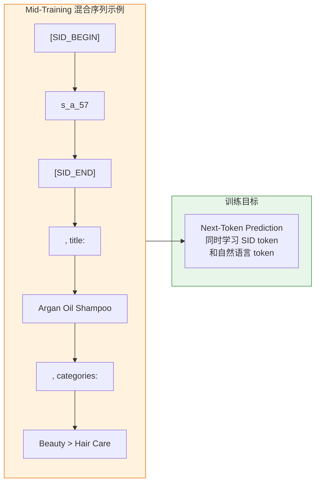

### 2.4 阶段 2: 推理数据生成

#### 2.4.1 Chat 格式训练数据

训练样本采用三角色 chat 格式：

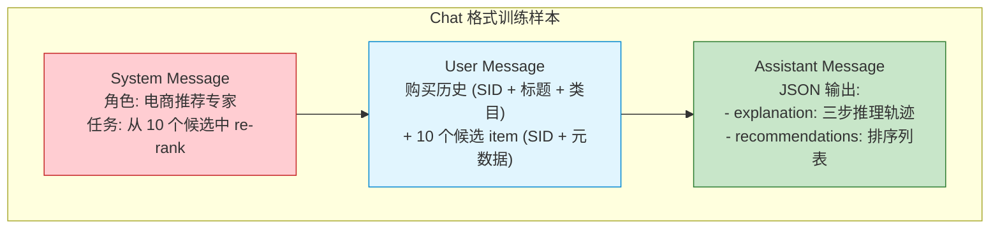

#### 2.4.2 两种推理轨迹生成策略

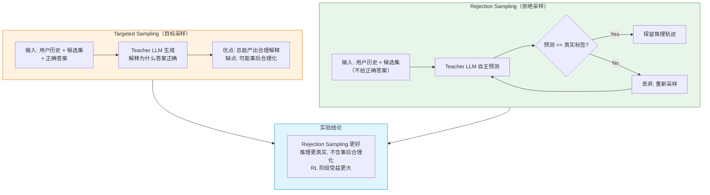

#### 2.4.3 五条 Prompt 设计原则

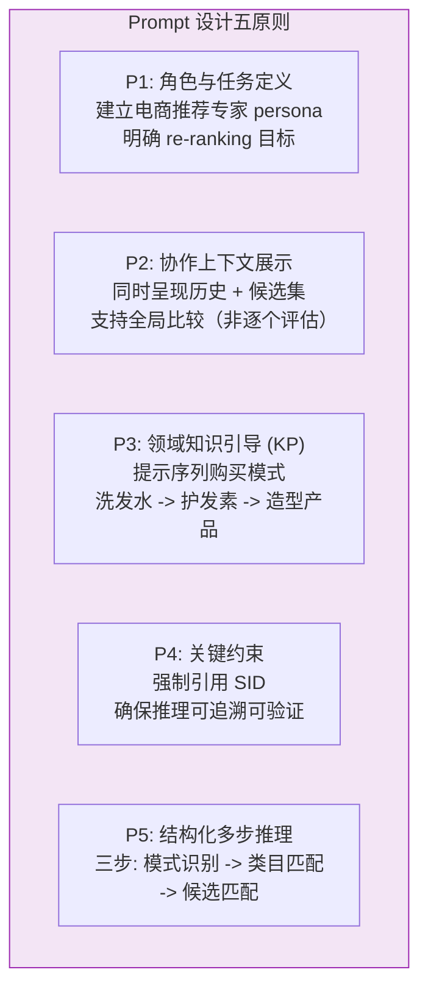

### 2.5 阶段 3: 推理能力激活

#### 2.5.1 SFT 阶段

用生成的推理轨迹微调 student LLM（Qwen3-8B）。损失函数**解耦推理和排序**：

```
L_SFT = -lambda_r * sum(log P(r_i | P, r_<i))
        -lambda_o * sum(log P(o_j | P, tau, o_<j))

其中 lambda_r < lambda_o（排序权重 > 推理权重）
只对 assistant message 计算损失
```

#### 2.5.2 RL 阶段 (DAPO)

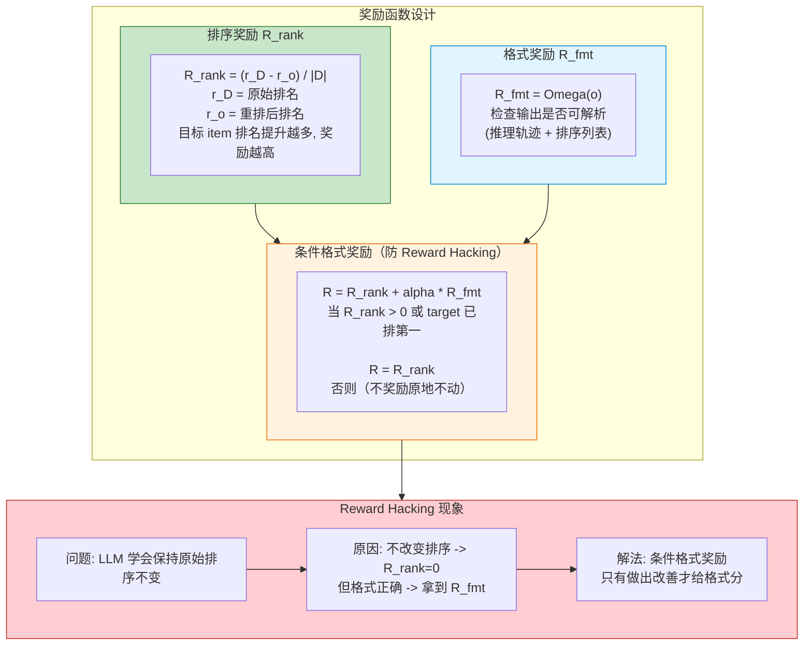

**DAPO 算法特性** (基于 GRPO 改进):

| 特性 | 说明 |
|------|------|
| Clip-Higher 策略 | 解耦上下裁剪范围 (epsilon_low, epsilon_high) |
| 过滤无效 prompt | 准确率为 0 或 1 的 prompt 不产生梯度, 过滤掉 |
| 过采样 | 过采样低优势样本, 提升样本效率 |
| Token 级优化 | 每个 token 独立计算 importance ratio |

### 2.6 实验结果

#### 2.6.1 数据集

| 数据集 | 用户数 | Item 数 | 平均序列长度 |
|--------|--------|---------|-------------|
| Amazon Beauty | 22,363 | 12,101 | 8.87 |
| Amazon Sports | 35,598 | 18,357 | 8.32 |

#### 2.6.2 Mid-Training 性能 vs OneRec-Think

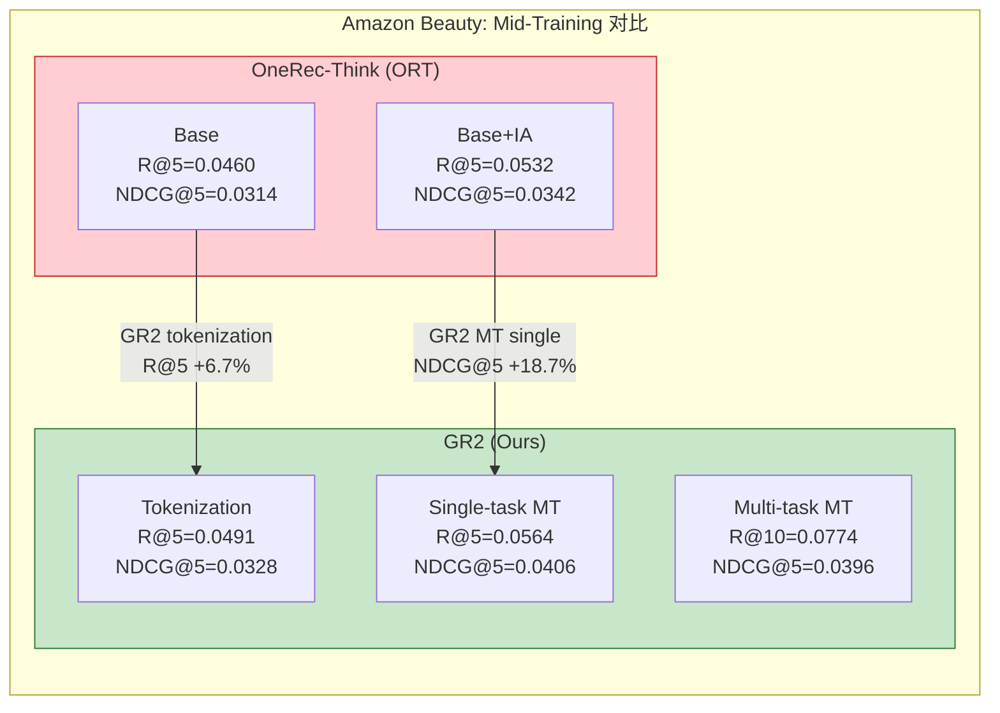

#### 2.6.3 Re-ranking 性能（Amazon Beauty）

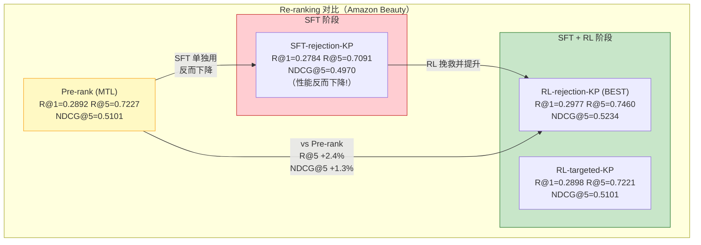

#### 2.6.4 关键发现

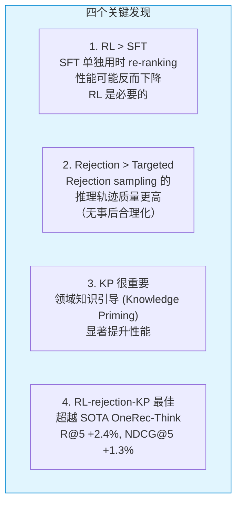

### 2.7 启示

1. **Re-ranking 是 LLM 推荐系统中被忽视但重要的环节** — 不同于检索/排序，re-ranking 需要对候选集进行精细比较
2. **推理能力对 re-ranking 至关重要** — 但仅靠 SFT 不够，需要 RL 来真正优化排序目标
3. **SID 的唯一性和语义性存在 trade-off** — contrastive loss 降低唯一性但提升推荐质量
4. **Reward 设计需要防范 hacking** — 条件格式奖励是一个有效的防御手段

---

## 两篇论文的对比与联系

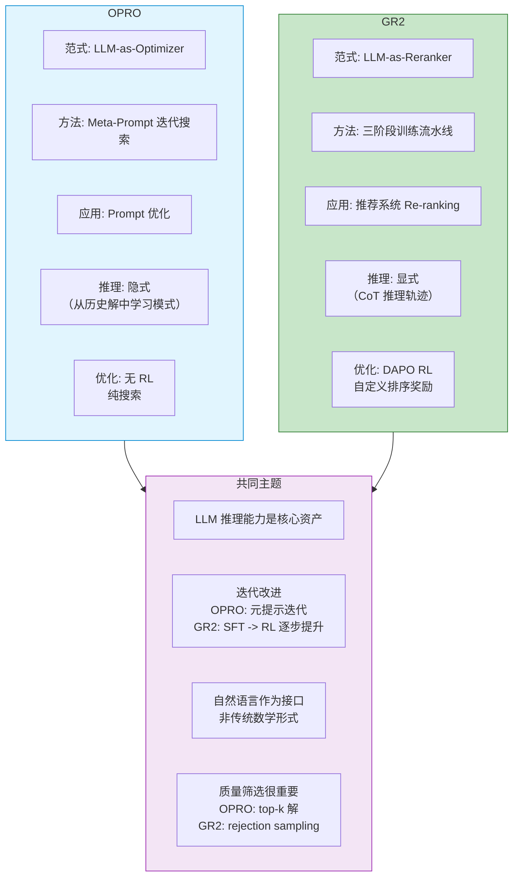

| 维度 | OPRO | GR2 |
|------|------|-----|
| **核心范式** | LLM 作为通用优化器 | LLM 作为推荐 re-ranker |
| **优化对象** | Prompt / 数学问题的解 | 候选 item 的排序 |
| **搜索方法** | 元提示迭代搜索 | 三阶段训练 (mid-training - SFT - RL) |
| **LLM 角色** | 优化器 + 评分器 | 推理器 + 排序器 |
| **推理方式** | 隐式（从历史中学习） | 显式（CoT 推理轨迹） |
| **RL 使用** | 无 | DAPO + 自定义排序奖励 |
| **规模** | 学术验证 (GSM8K, BBH) | 工业级 (Amazon, 面向大规模部署) |
| **共同点** | 都利用 LLM 推理能力解决传统方法难以处理的优化/排序问题 |
